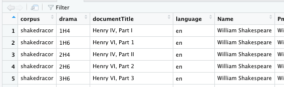

```{r setup, include=FALSE}
knitr::opts_chunk$set(eval = FALSE, tidy = FALSE, message = FALSE, warning = FALSE)
options(tikzDefaultEngine = 'xetex')

#options(tikzXelatexPackages = c(getOption("tikzXelatexPackages"), "\\setmainfont{Helvetica Neue}"))

library(DramaAnalysis)
setDataDirectory(dataDirectory = file.path(getwd(), "Data"))
installData("shakedracor")
library(magrittr)
```

# What you really need to know about R

### R Basics

- R is a programming language 
  - Mostly used for statistical data analysis ("data science")
  - First version: 1993
  - Current stable release: 3.6
  - [Website](https://www.r-project.org/)
- Three important concepts we need to talk about
  - Objects/Types
  - Variables
  - Functions

### R Basics
\framesubtitle{Objects and Types}

- Objects live in the computer memory (or on disk)
- Objects represent the things we want to analyse (e.g., dramatic texts, words, or numbers)
- An object has one or more types
- The type of an object determines what we can do with it
  - E.g., a knife allows other operations than a fork
\pause
- Types: Numbers, strings, lists, tables, ...
  - Numbers allow arithmetic operations
    - E.g., summation: `sum(3,5)` (evaluates to `8`, equivalent to `3+5`)
  - Strings allow character-based operations
    - E.g., conversion to lower case: `tolower("ABC")` (evaluates to `"abc"`)
\pause
- "evalutes to": result of the operation

### R Basics
\framesubtitle{Objects and Types}

\small
| Type | Example | Description |
| ---- | ------- | ----------- |
| Numeric | `5` | A numeric value |
| Character | `"Heidelberg"` | A sequence of characters |
|           |                | (note the double quotes!) |
| Logical | `TRUE`/`FALSE` | A truth value |
| Vector | `c(5,4,1)` | Sequence of objects *of the same type* |
| List | `list(5,"Hd",TRUE)` | Sequence of objects |
| Matrix | | Table of objects *of the same type* |
| Data frame | | Table of objects |


### R Basics
\framesubtitle{Objects and Types}

In R, everything is a vector!

- Entering `5` creates a numeric vector of length 1
- Entering `"Bla"` creates a character vector of length 1

(In this way, R is different from other programming languages)

```{r}
5
# Creates a vector consisting of the numbers 1 to 50
1:50
```


### R Basics
\framesubtitle{Variables}

- We usually do not interact with the objects directly
  - Because they are not known in advance (but loaded from files)
- Variables
  - A way to *name* objects
  - Used as a placeholder for objects
  - The actual operation takes place on the objects (R takes care of this)
- Creating a variable `a`: `a <- 3` (think of this as an arrow)

```r
> a <- 3
> b <- 5
> a + b
[1] 8
>
```

### R Basics
\framesubtitle{Functions}

- "Mini programs": A collection of instructions that you can use as a single instruction
- Input: Functions take *arguments* as input
- Output: Functions return an object (that stores the result of the instructions)
\pause
- Functions have a name (typically lower case) and can be reognized by the round parentheses \
`function(argument1, argument2, argument3, ...)`
- The return value of a function can be stored in a variable \
`variable <- function(arg1, arg2, ...)`
\pause
- Some functions not only return a value, but also do something (e.g., display a plot)

### R Basics
\framesubtitle{Functions}

```{r}
sum(5,1)         # 5 + 1 is only an abbreviation
s <- sum(5,1)    # stores the result in a 
                 # variable, no output
s                # prints the value of the variable
s <- 7           # overwrites the previous value of 
                 # the variable
s <- sum(s,3)    # overwrites the value of the 
                 # variable
```

What is the value of `s` now?

## RStudio


### RStudio

- An integrated development environment (IDE) for R
- Capable workbench for data analysis

 {height=0.3\\textheight}

### RStudio
\framesubtitle{Four Panes}

- Console: Where you enter R code and get the result immediately
- Environment: Shows the objects currently in memory
- Plots: Shows plots
- Editor/Code: Allows editing R code and inspecting tables

We will focus on the console and plot area

# DramaAnalysis

### Outline

- Introduction/Installation and Overview
- Three areas for you to play with
  1. Global character statistics
  2. Word fields
  3. Copresence and network analysis

### Introduction

- R Package: A collection of functions and/or data sets
- Function: Mini program
- DramaAnalysis: Functions for drama analysis (surprise!)
  - Today: Third iteration, extensive rewrite
- Philosophy: Construction kit

## Installation

### Installation
\framesubtitle{Code}

```{r, eval=FALSE}
install.packages("DramaAnalysis")
library(DramaAnalysis)  # no quotes

 # additional package
library(magrittr)
```

\pause


\vspace{-3cm}

{ width=50% }

### Installation
\framesubtitle{Data}

- Dramatic texts are initially stored as TEI/XML files
- Language processing (e.g., identification of parts of speech) takes place in a UIMA pipeline
  - https://github.com/quadrama/DramaNLP
- Output of the pipeline: Several CSV files for each play (meta data, character data, \dots)
- CSV files analysed in R

\pause

Two corpora today:

```{r}
installData("qd") # German literary canon
# or
installData("shakedracor") # English Shakespeare plays
```

### Installation
\framesubtitle{Data}

The function `installData()`

- Clones a git repository from `github.com/quadrama` into a local directory
- Allows easy update of data files
- German literary canon (`qd`)
  - TextGrid $\rightarrow$ GerDraCor $\rightarrow$ QuaDramA
- English Shakespeare plays (`shakedracor`)
  - Folger $\rightarrow$ DraCor $\rightarrow$ QuaDramA

### Inspecting data

```{r}
# Collect all play ids into a vector
loadAllInstalledIds() %>% 
  # Extract metadata for each play, 
  # put it into a table
  loadMeta()          %>% 
  # Have RStudio display a nice table
  View()           
```

\pause



### Loading a play 

- We first have to load plays into the environment
- Each play has an associated id
- Select one and create a variable to store the id (less typing in the future)

\pause

```{r}
# General form: collection colon play
# (allows comparison across collections)
myId <- "shakedracor:Rom"

play <- loadDrama(myId)
```

### Online help

- Each function is documented
- Entering question mark followed by the function name opens the help view
  - `?loadDrama`
- Documentation
  - What does the function do?
  - What arguments does it expect, which default values are defined?
  - What does it return?
  - Usage example

\pause

Package documentation: https://quadrama.github.io/DramaAnalysis/3.0.0

Tutorial: https://quadrama.github.io/DramaAnalysis/tutorial/3/index.html


## What can we do?

### Function overview


## 1. Global character statistics (Who and when are they?)

### Global character statistics

Two functions:

- `characterStatistics()`: Characters in focus
- `utteranceStatistics()`: Utterances in focus

### Function `characterStatistics`

```{r}
cs <- characterStatistics(play)
```

Returns a table (in R: `data.frame`) with 

- `corpus`: The collection id
- `drama`: The play id
- `character`: the character id
- `tokens`: Number of tokens (for this character)
- `types`: Number of different tokens (for this character)
- `utterances`: Number of utterances (for this character)
- `utteranceLengthMean`: Mean utterance length 
- `utteranceLengthSd`: Utterance length standard deviation
- `firstBegin`: Starting position of the first utterance
- `lastEnd`: End position of the last utterance

(The function `View()` can be used to get browsable table in RStudio.)


### Function `characterStatistics` {.allowframebreaks}
\framesubtitle{Plotting}

```{r eval=TRUE,fig.width=2.5,fig.height=3, out.height="0.5\\textheight", dev='tikz', results='hide', tidy=FALSE, message=FALSE}
# load a play
play <- loadDrama("shakedracor:Rom")

# call the function
characterStatistics(play) %>%
  # replace character ids by character names
  characterNames(play) %>%
  # plot them stacked
  barplot()
```

### Function `utteranceStatistics`

```{r}
us <- utteranceStatistics(play)
```

Returns a table with one row for each utterance

- `corpus`: The collection id
- `drama`: The play id
- `character`: the character id
- `utteranceBegin`: Character position of the first character
- `utteranceLength`: Portion of this utterance with the total play

(The function `View()` can be used to get browsable table in RStudio.)

### Function `utteranceStatistics`  {.allowframebreaks}
\framesubtitle{Plotting}

\small
```{r eval=TRUE, message=FALSE, warning=FALSE, dev="tikz"}
play <- loadDrama("shakedracor:Rom")

# get utterance statistics
us <- utteranceStatistics(play) %>%
  # remove uninteresting characters
  filterCharacters(play) %>%
  # replace ids by names
  characterNames(play)

# plot boundaries
par(mar=c(2,7,1,1))
# plot the utterances
stripchart(utteranceLength ~ character, 
        data = us,
        las=1,
        pch=20,
        method="jitter")
```


## 2. Word fields (What are they actually talking about?)

### Word fields

Word fields: Semantically related words

- Represented as a vector of strings in R
- E.g., `r c("love", "heart")` is a word field related to love

Work steps

1. Define a word field: base R, `loadFields()`
2. Apply it to text(s): `dictionaryStatistics()`

### Word Fields
\framesubtitle{Define a word field}

Definition of a word field manually on the fly

```{r}
fields <- list(
  # words related to family
  Family=c("marriage", "parents", "ancestors", ...),
  # words related to love
  Love=c("love", "heart", "kiss", ...))
```

```{r echo=FALSE, eval=TRUE}
fields <- list(
  # words related to family
  Family=c("marriage", "parents", "ancestors"),
  # words related to love
  Love=c("love", "heart", "kiss"))
```

Creates a named list of lists


### Word Fields
\framesubtitle{Define a word field: Function `loadFields()`}

- Function to load word fields from URLs or files
- Load pre-defined (German) word lists

```{r}
fields <- loadFields(fieldnames=c("Liebe", "Familie"))
```

Returns a named list of lists

### Word Fields
\framesubtitle{Other sources}

- Defining word fields manually is not trivial (historic language(s), bias, ...)
- Existing dictionaries can be used as sources
- Enriching fields with distributionally similar words


### Word Fields
\framesubtitle{Application: `dictionaryStatistics()`}

```{r message=FALSE, eval=TRUE}
play <- loadDrama("shakedracor:Rom")
ds <- dictionaryStatistics(play, fields)
```

Returns a table with columns

- `corpus`, `drama`: See above
- `character`: The character id
- one column for each field

\pause

```{r eval=TRUE,echo=FALSE}
ds[1:3,]
```

### Word Fields
\framesubtitle{Normalization}

- Different characters have different portions of speech in the play
- Word fields may be differently large
\pause
- Normalization is important
  - No one fits all mechanic
  - It depends on the research question

\pause

Two parameters (both can be set to TRUE/FALSE)

- `normalizeByCharacter`
- `normalizeByField`

\pause

Normalized numbers tend to be very small, but that does not hinder their meaningfulness

### Word Fields {.allowframebreaks}
\framesubtitle{Plotting}

```{r eval=TRUE}
ds <- dictionaryStatistics(play, fields) %>%
  filterCharacters(play) %>%
  characterNames(play)

dsm <- as.matrix(ds)

par(mar=c(10,2,1,1))
barplot(t(dsm), 
        beside=TRUE, 
        names.arg = ds$character,
        legend.text = colnames(dsm),
        las=2)
```

## 3. Character Relations (With whom are they interacting?)

### Character Relations

- Configuration: A matrix showing who is on stage when

Functions

- `configuration()`
- `presence()`

Package `igraph`

### Character Relations {.allwoframebreaks}
\framesubtitle{Function `configuration()`}

```{r eval=TRUE}
play <- loadDrama("shakedracor:Rom")
conf <- configuration(play)
```

Table with columns

- `corpus`, `drama`, `character`
- One column per segment, filled with the number of words spoken by a character 


### Character Relations {.allowframebreaks}
\framesubtitle{Plotting}

```{r eval=TRUE,out.height="0.8\\textheight"} 
c <- configuration(play) %>%
  filterCharacters(play, n=5) %>%
  characterNames(play)

mat <- as.matrix(c)
par(mar=c(2,2,2,10))

barplot(mat, 
        legend.text = c$character)
```