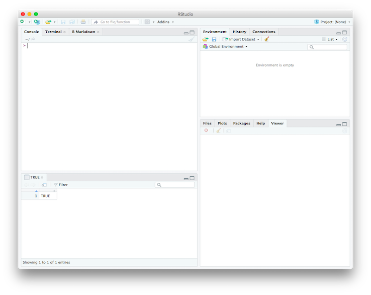

```{r setup, include=FALSE}
knitr::opts_chunk$set(echo = TRUE, cache=TRUE)
```

## Outline

- Installation and Setup
- R Basics and RStudio
- The R package `DramaAnalysis`

# Installation and Setup

## Needed for this tutorial

- [R](https://cran.r-project.org)
- [RStudio](https://www.rstudio.com)

- Once RStudio is running:\
  type `install.packages("devtools")` in the **Console**

``` 
> install.packages("devtools")
trying URL 'https://cran.rstudio.com/bin/macosx/el-capitan/contrib/3.5/devtools_1.13.5.tgz'
Content type 'application/x-gzip' length 702722 bytes (686 KB)
==================================================
downloaded 686 KB


The downloaded binary packages are in
	/var/folders/mj/_qhr36wj3gdczq38qy96hxf00000gp/T//RtmpkTLQ16/downloaded_packages
> 
```

## Installation of DramaAnalysis package

Type `devtools::install_github("quadrama/DramaAnalysis")` in the console

```
> devtools::install_github("quadrama/DramaAnalysis")
Downloading GitHub repo quadrama/DramaAnalysis@master
from URL https://api.github.com/repos/quadrama/DramaAnalysis/zipball/master
Installing DramaAnalysis
trying URL 'https://cran.rstudio.com/bin/macosx/el-capitan/contrib/3.5/rmarkdown_1.10.tgz'
Content type 'application/x-gzip' length 2804704 bytes (2.7 MB)
==================================================
downloaded 2.7 MB
... 
```

# R Basics and RStudio

## R Basics

- R is a programming language 
  - Mostly used for statistical data analysis ("data science")
  - First version: 1993
  - Current stable release: 3.5
  - [Website](https://www.r-project.org/)
- Three important concepts we need to talk about
  - Objects
  - Types
  - Variables
  - Functions

## R Basics -- Objects and Types {.smaller}

- Objects live in the computer memory (or on disk)
- Objects represent the things we want to analyse (e.g., dramatic texts, words, or numbers)
- An object has one or more types
- The type of an object determines what we can do with it
  - E.g., a knife allows other operations than a fork
- Types: Numbers, strings, lists, tables, ...
  - Numbers allow arithmetic operations
    - E.g., summation: `sum(3,5)` (evaluates to `8`, equivalent to `3+5`)
  - Strings allow character-based operations
    - E.g., conversion to lower case: `tolower("ABC")` (evaluates to `"abc"`)
- "evalutes to" -> we will come back to this

## R Basics -- Objects and Types

| Type | Example (in R syntax) | Description |
| ---- | ------- | ----------- |
| Numeric | `5` | A numeric value |
| Character | `"Heidelberg"` | A sequence of characters (note the double quotes!) |
| Logical | `TRUE`/`FALSE` | A truth value |
| Vector | `c(5,4,1)` | A sequence of objects *of the same type* |
| List | `list(5,"Hd",TRUE)` | A sequence of objects |
| Matrix | | A table of objects *of the same type* |
| Data frame | | A table of objects |


## R Basics -- Objects and Types

In R, everything is a vector!

- Entering `5` creates a numeric vector of length 1
- Entering `"Bla"` creates a character vector of length 1

(In this way, R is different from other programming languages)

```{r}
5
# Creates a vector consisting of the numbers 1 to 50
1:50
```


## R Basics -- Variables

- We usually do not interact with the objects directly
  - Because they are not known in advance (but loaded from files)
- Variables
  - A way to *name* objects
  - Used as a placeholder for objects
  - The actual operation takes place on the objects (R takes care of this)
- Creating a variable `a`: `a <- 3` (think of this as an arrow)
```
> a <- 3
> b <- 5
> a + b
[1] 8
>
```

## R Basics -- Functions

- "Mini programs": A collection of instructions that you can use as a single instruction
- Input: Functions take *arguments* as input
- Output: Functions return an object (that stores the result of the instructions)
- Functions have a name (typically lower case) and can be reognized by the round parentheses \
`function(argument1, argument2, argument3, ...)`
- The return value of a function can be stored in a variable \
`variable <- function(arg1, arg2, ...)`
- Some functions not only return a value, but also do something (e.g., display a plot)

## R Basics -- Functions

```{r}
sum(5,1)         # 5 + 1 is only an abbreviation
s <- sum(5,1)    # stores the result in a variable, doesn't produce output
s                # prints the value of the variable
s <- 7           # overwrites the previous value of the variable
s <- sum(s,3)    # overwrites the value of the variable
```

What's the value of `s` now?

## RStudio

- An integrated development environment (IDE) for R
- Cabapble workbench for data analysis



## RStudio -- 4 Panes

- Console: Where you enter R code and get the result immediately
- Environment: Shows the objects currently in memory
- Plots: Shows plots
- Help: Shows documentation for functions
- Editor: Allows editing R code and inspecting tables

(some have multiple tabs)

# The R Package DramaAnalysis

## Background

- Dramatic texts are initially stored as TEI/XML files
- Language processing (e.g., detection of parts of speech) takes place in a UIMA pipeline
- The output of the pipeline are several CSV files for each play
  - Meta data
  - Character data
  - Utterances
  - Segments (scenes and acts)
  - Stage directions (work in progress)
- CSV files are then analyzed in R


## Setup {.smaller}

Loading the package
```{r}
library(DramaAnalysis) # no quotes here!
```

Install preprocessed data

1. Find out the directory in which data needs to be stored `getOption("qd.datadir")`
2. Open this directory in your file browser (e.g., Explorer, Finder)
3. Download this file: [github.com/quadrama/data_gdc/archive/master.zip](https://github.com/quadrama/data_gdc/archive/master.zip) and unpack it into the previously opened folder
4. Verify: There should be a directory `gdc` with a sub folder `csv`. The `csv` folder contains a lot of files.

## Verification {.smaller}

```{r}
allIds <- loadAllInstalledIds()    # stores a character vector of all play ids
allIds      # prints out the character vector
```

## Step 1: Select a Play

Load meta data for all ids

```{r, eval=FALSE}
allMeta <- loadMeta(allIds)
View(allMeta)    # This should open the table with 
                 # meta data in a new pane
```

Select one play of your choice, and create a new variable that contains the id, for example:

```{r}
myId <- "gdc:tx4z.0"  # Don Carlos 
```

For the following analysis steps, everyone gets different results!
